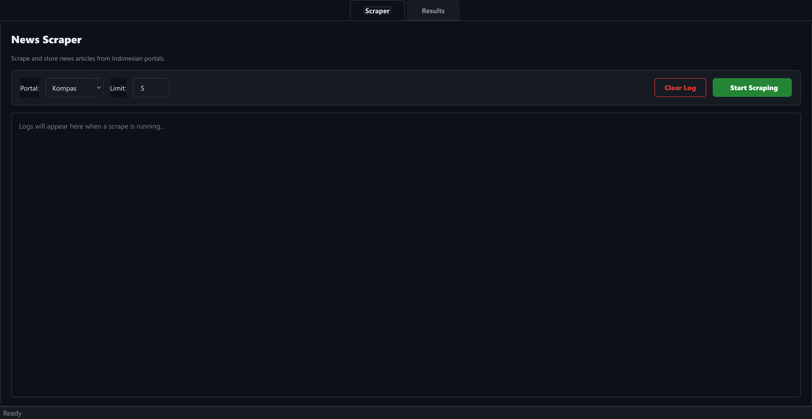
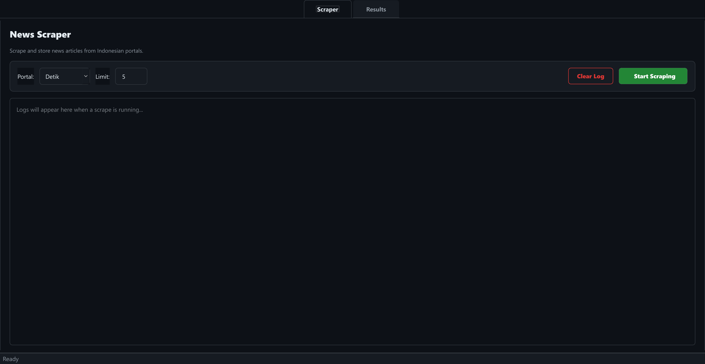
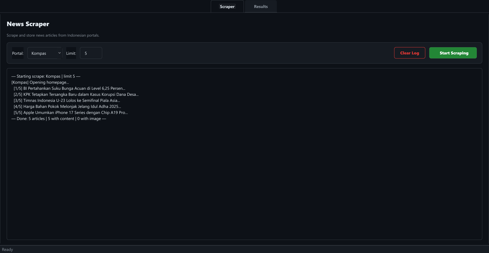
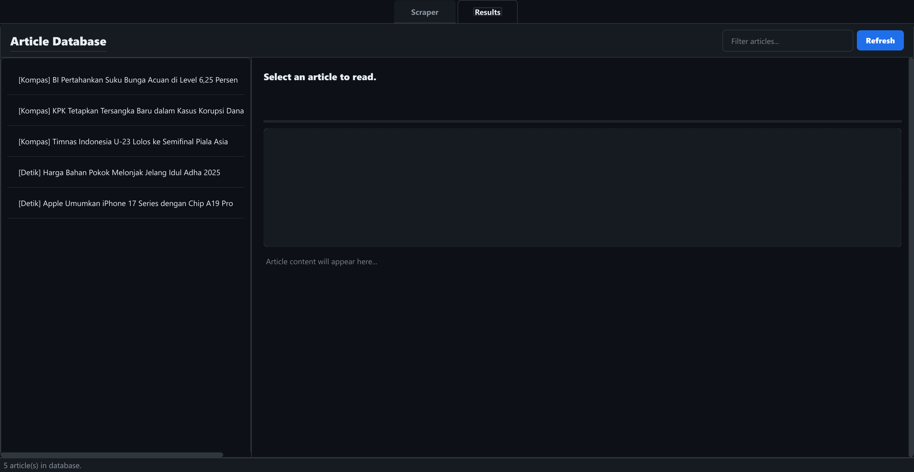
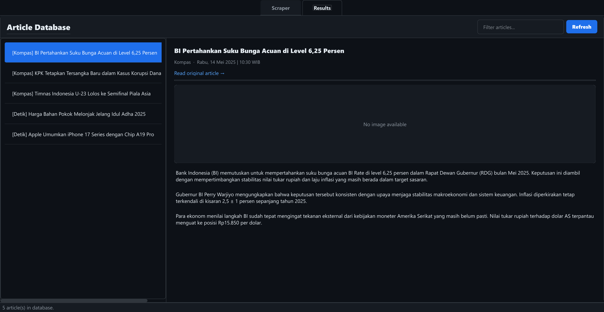
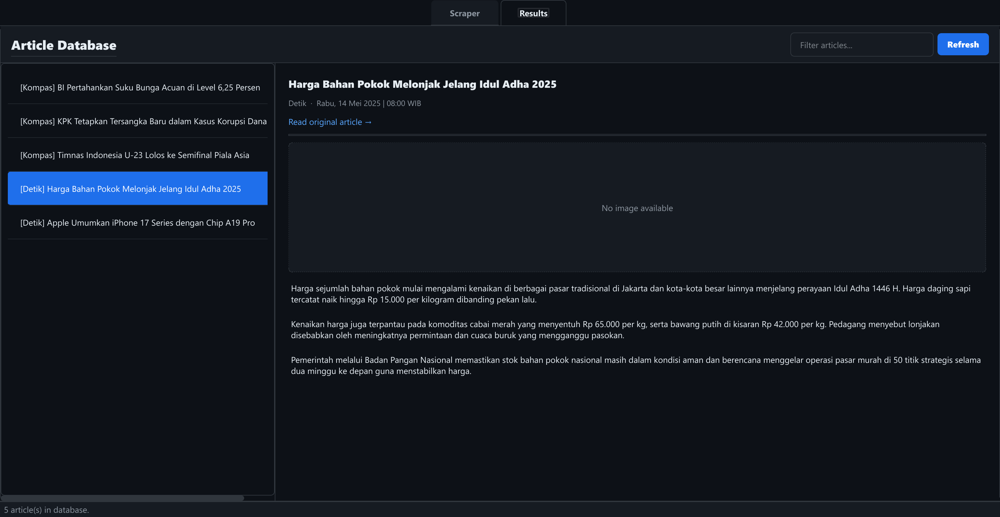
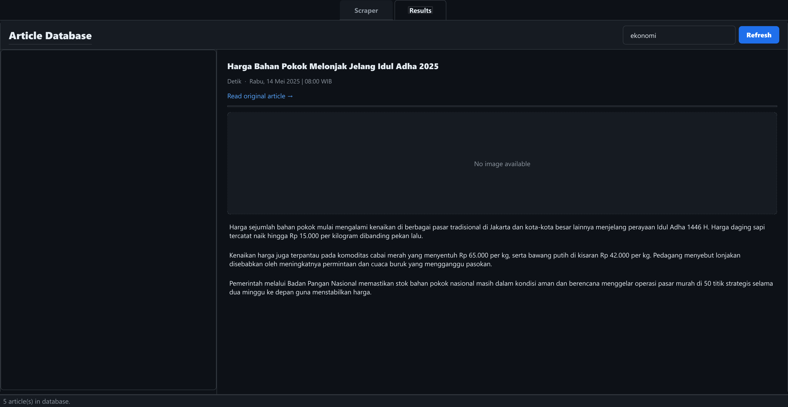
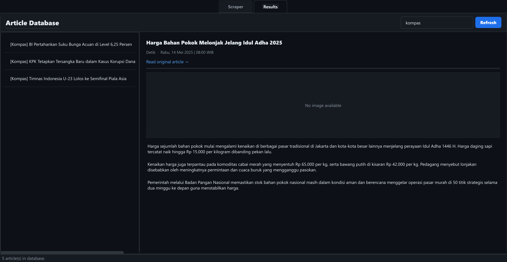

# News Scraper Professional

Aplikasi desktop berbasis Python yang mampu melakukan **web scraping** artikel berita dari portal berita Indonesia secara otomatis, menampilkan hasilnya dalam antarmuka grafis (GUI) yang modern, serta menyimpan data ke format JSON dan CSV.

---

## Tampilan Aplikasi

### Tab Scraper — Kondisi Awal


### Memilih Portal Kompas


### Memilih Portal Detik


### Log Scraping Real-Time


### Tab Results — Daftar Artikel


### Detail Artikel dari Kompas


### Detail Artikel dari Detik


### Fitur Filter / Pencarian


### Filter per Portal


---

## Struktur Folder

```
berita/
├── main.py                  # Entry point aplikasi
├── requirements.txt         # Daftar dependensi Python
├── screenshots/             # Screenshot tampilan aplikasi
├── output/                  # Hasil scraping (dibuat otomatis saat runtime)
│   ├── berita.json          # Data artikel format JSON
│   ├── berita.csv           # Data artikel format CSV
│   └── images/              # Gambar cover artikel yang diunduh
│
├── core/
│   └── driver.py            # Factory untuk inisialisasi Selenium WebDriver
│
├── models/
│   └── news_item.py         # Model data: NewsItem dan ContentBlock
│
├── scrapers/
│   ├── kompas.py            # Scraper untuk kompas.com
│   └── detik.py             # Scraper untuk detik.com
│
├── ui/
│   ├── app_window.py        # Jendela utama GUI (PyQt5)
│   └── threading.py         # Worker thread untuk scraping di background
│
└── utils/
    └── saver.py             # Utilitas penyimpanan data dan pengunduhan gambar
```

---

## Tech Stack

| Komponen | Teknologi | Versi | Kegunaan |
|---|---|---|---|
| **Bahasa** | Python | 3.x | Bahasa pemrograman utama |
| **GUI Framework** | PyQt5 | 5.15.x | Membangun antarmuka grafis desktop |
| **Browser Automation** | Selenium | 4.x | Mengotomatisasi browser Chrome untuk scraping |
| **Driver Manager** | webdriver-manager | 4.x | Mengunduh dan mengelola ChromeDriver secara otomatis |
| **HTTP Client** | requests | 2.x | Mengunduh gambar cover artikel |
| **Threading** | QThread (PyQt5) | — | Menjalankan scraping di background tanpa membekukan UI |
| **Data Format** | JSON & CSV | — | Penyimpanan hasil scraping |
| **CSS Selectors** | Selenium By.CSS_SELECTOR | — | Menargetkan elemen HTML di halaman web |

### Mengapa Selenium dan bukan `requests` + `BeautifulSoup`?

Portal berita modern seperti Kompas dan Detik me-render sebagian kontennya menggunakan **JavaScript** (lazy loading, infinite scroll). Library `requests` hanya mengambil HTML statis, sehingga banyak artikel tidak akan muncul. Selenium menjalankan browser Chrome sungguhan sehingga JavaScript dieksekusi, konten ter-render sepenuhnya, dan semua artikel bisa diakses.

---

## Arsitektur Aplikasi

```
┌─────────────────────────────────────────────────────┐
│                   main.py                           │
│           QApplication + AppWindow                  │
└──────────────────────┬──────────────────────────────┘
                       │
          ┌────────────▼────────────┐
          │      ui/app_window.py   │
          │  ┌──────────────────┐   │
          │  │  Tab: Scraper    │   │
          │  │  Tab: Results    │   │
          │  └──────┬───────────┘   │
          └─────────┼───────────────┘
                    │ memicu
          ┌─────────▼───────────────┐
          │   ui/threading.py       │
          │   ScrapeWorker (QThread)│
          │   - log signal          │
          │   - finished signal     │
          │   - error signal        │
          └─────────┬───────────────┘
                    │ memanggil
        ┌───────────┴──────────────┐
        │                          │
┌───────▼────────┐      ┌──────────▼───────┐
│scrapers/       │      │ utils/saver.py   │
│kompas.py       │      │ - save_to_json() │
│detik.py        │      │ - save_to_csv()  │
│                │      │ - download_image │
└───────┬────────┘      └──────────────────┘
        │ menggunakan
┌───────▼────────┐      ┌──────────────────┐
│core/driver.py  │      │models/news_item  │
│DriverFactory   │      │NewsItem          │
│(Selenium Chrome│      │ContentBlock      │
└────────────────┘      └──────────────────┘
```

---

## Fitur-Fitur Aplikasi

### 1. Tab Scraper

Tab utama untuk mengonfigurasi dan menjalankan proses scraping.

#### a. Pemilihan Portal Berita
- Pengguna dapat memilih portal sumber berita melalui **dropdown** (`QComboBox`).
- Portal yang tersedia: **Kompas** (`kompas.com`) dan **Detik** (`detik.com`).

#### b. Pengaturan Limit Artikel
- Input angka (`QLineEdit`) untuk menentukan **berapa banyak artikel** yang ingin di-scrape (default: 5).
- Jika input tidak valid, sistem otomatis menggunakan nilai default 5.

#### c. Tombol Start Scraping
- Memulai proses scraping di **thread terpisah** (non-blocking) sehingga UI tetap responsif.
- Tombol dinonaktifkan sementara selama scraping berlangsung untuk mencegah double-run.

#### d. Progress Bar (Indeterminate)
- Muncul saat scraping sedang berjalan sebagai indikator visual aktivitas.
- Hilang otomatis setelah scraping selesai.

#### e. Log Area Real-Time
- Area teks (`QTextEdit` read-only) yang menampilkan **log scraping secara langsung** via Qt signal.
- Setiap langkah scraping (membuka halaman, menemukan artikel, mengambil konten) ditampilkan secara berurutan.

#### f. Tombol Clear Log
- Menghapus seluruh isi area log dengan sekali klik.
- Bergaya "danger button" (outline merah) untuk membedakan dari aksi utama.

#### g. Status Bar
- Baris bawah jendela yang menampilkan status terkini: `Ready`, `Scraping...`, atau ringkasan hasil.

---

### 2. Tab Results

Tab untuk melihat dan menjelajahi semua artikel yang sudah di-scrape.

#### a. Daftar Artikel (Panel Kiri)
- `QListWidget` yang menampilkan semua artikel dari database `output/berita.json`.
- Setiap item dilabeli tag portal: `[Kompas]` atau `[Detik]` diikuti judul artikel.
- Klik item untuk menampilkan detail di panel kanan.

#### b. Fitur Filter / Pencarian
- Input teks di toolbar yang memfilter daftar artikel **secara real-time** saat pengguna mengetik.
- Pencarian bersifat case-insensitive dan mencari di seluruh teks item (judul + label portal).
- Artikel yang tidak cocok otomatis disembunyikan.

#### c. Tombol Refresh
- Memuat ulang data dari file `output/berita.json` tanpa perlu restart aplikasi.
- Berguna setelah scraping selesai atau setelah file diperbarui secara eksternal.

#### d. Panel Detail Artikel (Panel Kanan)
Menampilkan informasi lengkap artikel yang dipilih:

| Elemen | Keterangan |
|---|---|
| **Judul** | Judul lengkap artikel, dapat dipilih/disalin |
| **Metadata** | Nama portal dan tanggal publikasi |
| **Tautan Asli** | Hyperlink yang dapat diklik, membuka artikel di browser |
| **Gambar Cover** | Gambar cover artikel (jika berhasil diunduh), ditampilkan proporsional |
| **Isi Artikel** | Semua paragraf teks artikel yang berhasil di-scrape |

#### e. Layout Splitter
- Panel kiri (daftar) dan kanan (detail) dipisahkan oleh `QSplitter` yang **dapat digeser** sesuai preferensi pengguna.
- Proporsi default: 280px (daftar) : 740px (detail).

---

## Metodologi Scraping

Proses scraping dilakukan dalam **dua fase** untuk setiap portal:

### Fase 1 — Pengumpulan Metadata (Homepage)

```
1. Buka homepage portal (kompas.com / detik.com)
2. Tunggu 2 detik untuk render JavaScript awal
3. Scroll halaman 5x (masing-masing 700px) untuk memicu lazy-loading
4. Kumpulkan semua elemen <a> yang URL-nya mengandung pola artikel:
   - Kompas: href mengandung "/read/"
   - Detik:  href mengandung "/d-"
5. Filter duplikat (pakai set seen_urls)
6. Filter domain yang tidak relevan (video, iklan, dll.)
7. Ambil title dan link, simpan sebagai metadata
8. Berhenti saat jumlah artikel mencapai limit
```

### Fase 2 — Pengambilan Konten Artikel

```
Untuk setiap artikel di metadata:
1. Buka URL artikel
2. Ambil tanggal publikasi (dicoba beberapa CSS selector)
3. Ambil URL gambar cover (dicoba beberapa CSS selector)
4. Scrape content blocks dari container utama:
   - Kompas: div.read__content
   - Detik:  .detail__body-text
   Untuk setiap child <p> atau :
   - <p>  → ContentBlock(type="text",  value=teks paragraf)
   - → ContentBlock(type="image", value=URL gambar)
5. Unduh gambar cover via HTTP (requests)
6. Buat objek NewsItem dan tambahkan ke list hasil
```

### Penanganan Timeout dan Error

- **Page load timeout** diset ke **25 detik** per halaman.
- Jika timeout terjadi, script memanggil `window.stop()` via JavaScript untuk menghentikan loading, lalu melanjutkan ke artikel berikutnya (tidak crash).
- Setiap blok pengambilan konten dibungkus `try/except` sehingga satu artikel gagal tidak menghentikan keseluruhan proses.

### Anti-Detection

ChromeDriver dikonfigurasi dengan beberapa opsi untuk meminimalkan deteksi bot:

- `--disable-blink-features=AutomationControlled` — menyembunyikan tanda otomasi
- `excludeSwitches: ["enable-automation"]` — menghapus flag otomasi dari Chrome
- Custom `User-Agent` yang menyerupai browser nyata
- `page_load_strategy = "eager"` — tidak menunggu semua resource selesai dimuat

---

## Model Data

### `NewsItem`

```python
@dataclass
class NewsItem:
    title: str               # Judul artikel
    date: str                # Tanggal publikasi (string)
    link: str                # URL artikel asli
    portal: str              # Nama portal ("Kompas" / "Detik")
    content_blocks: List[ContentBlock]  # Daftar blok konten
    image_url: str           # URL gambar cover (online)
    image_path: str          # Path gambar cover (lokal)
```

### `ContentBlock`

```python
@dataclass
class ContentBlock:
    block_type: str   # "text" atau "image"
    value: str        # Isi teks paragraf / URL gambar inline
```

### Contoh Output JSON (`output/berita.json`)

```json
[
  {
    "title": "BI Pertahankan Suku Bunga Acuan di Level 6,25 Persen",
    "date": "Rabu, 14 Mei 2025 | 10:30 WIB",
    "link": "https://www.kompas.com/read/2025/05/14/...",
    "portal": "Kompas",
    "content_blocks": [
      { "type": "text",  "value": "Bank Indonesia (BI) memutuskan..." },
      { "type": "image", "value": "https://asset.kompas.com/..." }
    ],
    "image_url": "https://asset.kompas.com/...",
    "image_path": "output/images/kompas_12345678.jpg"
  }
]
```

---

## Desain Threading

Scraping dijalankan di **thread terpisah** menggunakan `QThread` dari PyQt5 agar UI tidak membeku (freeze) selama proses berjalan.

```
Main Thread (UI)              Worker Thread (ScrapeWorker)
─────────────────             ──────────────────────────────
Klik "Start Scraping"
  └─► buat ScrapeWorker  ──► run()
  └─► worker.start()          └─► scraper.scrape()
                                    ├─► log.emit("...")   ──► _log() di UI
                                    ├─► [scraping...]
                                    └─► finished.emit()  ──► _on_finished() di UI
                                    atau
                                    └─► error.emit()     ──► _on_error() di UI
```

Komunikasi antar thread dilakukan secara aman melalui **Qt Signals & Slots**:
- `log (str)` — mengirim pesan log ke UI
- `finished (list)` — mengirim daftar `NewsItem` hasil scraping
- `error (str)` — mengirim pesan error jika terjadi exception

---

## Penyimpanan Data (`utils/saver.py`)

### `DataSaver.save_to_json()`
Menyimpan semua artikel ke `output/berita.json` dalam format UTF-8 dengan indentasi rapi. Setiap objek `NewsItem` dikonversi ke `dict` via metode `to_dict()`.

### `DataSaver.save_to_csv()`
Menyimpan ringkasan artikel ke `output/berita.csv` dengan kolom:
`title`, `date`, `link`, `portal`, `content`, `image_url`, `image_path`

Kolom `content` berisi semua paragraf yang digabung dengan `\n\n` (memanggil `plain_text()`).

### `DataSaver.download_image()`
Mengunduh gambar cover dari URL menggunakan `requests` dengan:
- Header `User-Agent` untuk menghindari block
- Timeout 10 detik
- Streaming download (chunk 8KB) untuk efisiensi memori
- Caching sederhana: jika file sudah ada, tidak mengunduh ulang
- Nama file: `{portal}_{hash(url)}{ext}` untuk mencegah tabrakan nama

---

## Komponen Utama dan Penjelasannya

### `core/driver.py` — DriverFactory

Kelas statis yang menyediakan instance Selenium Chrome WebDriver yang sudah dikonfigurasi. Menggunakan `webdriver-manager` untuk mengunduh ChromeDriver yang sesuai dengan versi Chrome yang terinstall secara otomatis tanpa konfigurasi manual.

**Mode Headless**: Browser berjalan di background tanpa membuka jendela tampilan, diaktifkan dengan `--headless=new`.

---

### `scrapers/kompas.py` — KompasScraper

| Detail | Nilai |
|---|---|
| URL Target | `https://www.kompas.com/` |
| Selector Tautan Artikel | `a[href*='/read/']` |
| Selector Kontainer Konten | `div.read__content` |
| Selector Tanggal | `.read__time`, `time`, `.date` |
| Selector Gambar Cover | `.photo__wrap img`, `.read__photo img`, `figure img` |
| Domain yang Difilter | `kgnow.com`, `video.kompas.com`, `kognisi.id`, `gramedia.com`, `doubleclick` |

---

### `scrapers/detik.py` — DetikScraper

| Detail | Nilai |
|---|---|
| URL Target | `https://www.detik.com/` |
| Selector Tautan Artikel | `a[href*='/d-']` |
| Selector Kontainer Konten | `.detail__body-text` |
| Selector Tanggal | `.detail__date`, `time`, `.date` |
| Selector Gambar Cover | `.detail__media img`, `figure img` |
| Domain yang Difilter | `20.detik.com`, `tv.detik.com` |

---

### `ui/app_window.py` — AppWindow

Jendela utama aplikasi yang mewarisi `QMainWindow`. Membangun seluruh antarmuka dari kode Python murni (tanpa file `.ui`).

**Tema Visual**: Dark theme terinspirasi GitHub dengan palet warna:

| Nama | Hex | Kegunaan |
|---|---|---|
| BG_BASE | `#0d1117` | Latar utama |
| BG_CARD | `#161b22` | Latar kartu/panel |
| BG_HOVER | `#21262d` | Hover state |
| BORDER | `#30363d` | Garis batas |
| TEXT_PRI | `#e6edf3` | Teks utama |
| TEXT_SEC | `#8b949e` | Teks sekunder/meta |
| ACCENT | `#1f6feb` | Tombol aksen (biru) |
| GREEN | `#238636` | Tombol utama |
| RED | `#da3633` | Tombol danger |

Seluruh styling didefinisikan dalam satu string `STYLESHEET` menggunakan sintaks Qt CSS (QSS).

---

## Cara Instalasi dan Menjalankan

### Prasyarat
- Python 3.8 atau lebih baru
- Google Chrome terinstall di sistem
- Koneksi internet

### 1. Clone / Download Proyek

```bash
git clone <url-repo>
cd pbl1-eksplorasi/berita
```

### 2. Buat Virtual Environment (disarankan)

```bash
python3 -m venv venv
source venv/bin/activate        # Linux/macOS
venv\Scripts\activate           # Windows
```

### 3. Install Dependensi

```bash
pip install -r requirements.txt
```

Isi `requirements.txt`:
```
selenium
webdriver_manager
requests
PyQt5
```

> **Catatan**: `webdriver-manager` akan otomatis mengunduh ChromeDriver yang sesuai saat aplikasi pertama kali dijalankan. Tidak perlu mengunduh atau mengkonfigurasi ChromeDriver secara manual.

### 4. Jalankan Aplikasi

```bash
python3 main.py
```

---

## 📋 Cara Penggunaan

### Langkah 1 — Konfigurasi Scraping
1. Buka aplikasi, pastikan berada di tab **Scraper**.
2. Pilih portal berita dari dropdown: **Kompas** atau **Detik**.
3. Masukkan jumlah artikel yang diinginkan di kolom **Limit** (contoh: `10`).

### Langkah 2 — Mulai Scraping
1. Klik tombol **Start Scraping**.
2. Progress bar akan muncul dan log real-time akan tampil di area bawah.
3. Tunggu hingga log menampilkan pesan `── Done: X articles ──`.
4. Aplikasi otomatis berpindah ke tab **Results**.

### Langkah 3 — Membaca Hasil
1. Di tab **Results**, daftar artikel akan muncul di panel kiri.
2. Klik salah satu artikel untuk melihat detail lengkapnya di panel kanan.
3. Klik tautan **"Read original article →"** untuk membuka artikel di browser.

### Langkah 4 — Mencari Artikel
1. Ketik kata kunci di kotak **Filter articles...** di pojok kanan atas.
2. Daftar akan langsung difilter sesuai kata kunci (judul atau nama portal).
3. Kosongkan kolom filter untuk menampilkan semua artikel kembali.

### Langkah 5 — Akses Data Mentah
Setelah scraping, data tersimpan di:
- `output/berita.json` — Data lengkap dengan content blocks
- `output/berita.csv` — Ringkasan tabular untuk diolah di Excel/spreadsheet
- `output/images/` — Gambar cover artikel yang telah diunduh

---

## Menjalankan Script Screenshot

Script `take_screenshots.py` (di folder `pbl1-eksplorasi`) digunakan untuk mengambil screenshot semua fitur aplikasi secara otomatis menggunakan data mock.

```bash
cd pbl1-eksplorasi
python3 take_screenshots.py
```

Screenshot akan tersimpan di folder `berita/screenshots/` dengan nama file yang deskriptif.

---

## Diagram Alur Scraping

```
Pengguna klik "Start Scraping"
         │
         ▼
ScrapeWorker.run() [thread baru]
         │
         ▼
KompasScraper / DetikScraper .scrape()
         │
         ├─► Buka homepage
         ├─► Scroll halaman (lazy load)
         ├─► Kumpulkan link artikel
         │       └─► Filter duplikat & domain terlarang
         │
         └─► Untuk setiap artikel:
                 ├─► Buka URL artikel
                 ├─► Ambil tanggal
                 ├─► Ambil URL gambar cover
                 ├─► Scrape content blocks (p, img)
                 ├─► Download gambar via requests
                 └─► Buat objek NewsItem
                          │
                          ▼
                 DataSaver.save_to_json()
                 DataSaver.save_to_csv()
                          │
                          ▼
                 finished.emit(results)
                          │
                          ▼
                 AppWindow._on_finished()
                 └─► Load data ke tab Results
                 └─► Pindah ke tab Results
```

---

## Catatan Penting

- **Scraping membutuhkan waktu** karena harus membuka browser dan memuat halaman secara nyata. Estimasi: 30–90 detik untuk 5 artikel.
- **Struktur HTML portal bisa berubah** kapan saja. Jika scraper tiba-tiba tidak menemukan artikel, kemungkinan portal target telah memperbarui struktur halaman mereka dan CSS selector perlu diperbarui.
- **Gunakan secara bertanggung jawab**: Hindari scraping dalam jumlah sangat besar (> 50 artikel sekaligus) karena dapat membebani server portal target.
- Folder `output/` dibuat otomatis oleh aplikasi dan tidak perlu dibuat secara manual.

---

## Dikembangkan sebagai bagian dari PBL1 — Eksplorasi Python
